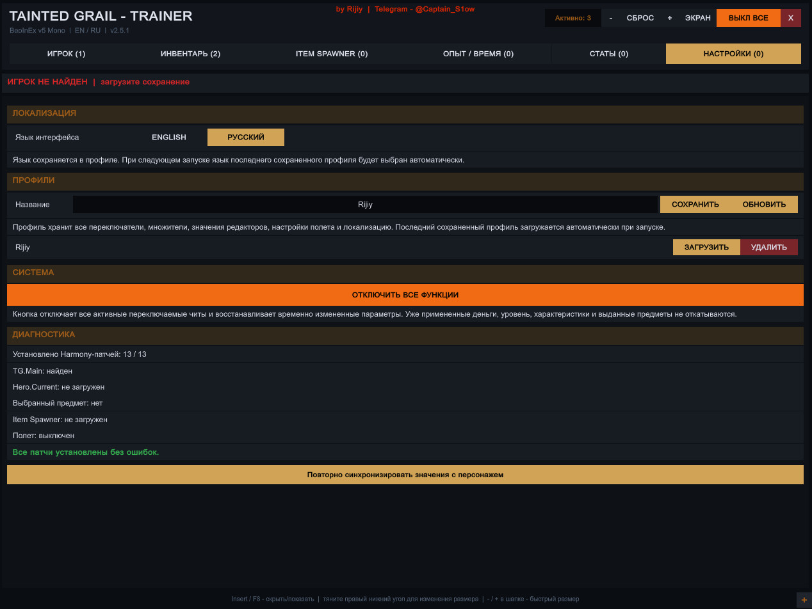

# Tainted Grail: The Fall of Avalon - Trainer

### by Rijiy

Telegram: [@Captain_S1ow](https://t.me/Captain_S1ow)

English | [Русский](README_RU.md)

[](https://github.com/Fenrisu1ven/FoA_Trainer/releases/latest)

[](https://github.com/BepInEx/BepInEx/releases)


**Current stable build: V18.4 / 2.6.4**

FoA Trainer is an in-game BepInEx trainer for **Tainted Grail: The Fall of Avalon**. It combines gameplay modifiers, character and inventory editing, profiles, Flight / NoClip, an advanced searchable Item Spawner, and a configurable ESP overlay in one bilingual EN/RU interface.

[Features](#features) • [Configurable ESP](#configurable-esp) • [Installation](#installation) • [Controls](#controls) • [Item Spawner](#item-spawner) • [Profiles](#profiles) • [Screenshots](#screenshots) • [Building](#building-from-source) • [Diagnostics](#diagnostics) • [Changelog](#changelog) • [Disclaimer](#disclaimer)

> [!NOTE]
> V18.4 is the current stability build. It is based directly on the confirmed-working V18.3 runtime and retains the conservative architecture required by the game's Mono.CSharp environment. Compatibility with every game release is not guaranteed.

## Features

### Player / Combat

- God Mode / Ignore Hits
- Infinite Health, Mana, Stamina, and other character resources
- Stealth Mode and Easy Lockpicking
- One Hit Kills
- Damage, defense, mana-consumption, and stamina-consumption multipliers
- Movement speed and jump-height controls
- No Fall Damage
- Flight / NoClip mode

### Inventory

- Money and Wyrd/resource editors
- Zero item and equipment weight
- Ignore crafting requirements
- Potion, consumable, material, and selected-item quantity editors
- Selected item level editor

### Character / World

- XP and proficiency/mastery controls and multipliers
- Level, attribute-point, and skill-point editors
- Editors for primary attributes and proficiency/mastery values
- Game speed, movement speed, frozen daytime, and daytime-speed controls

### Profiles / Interface

- Multiple named profiles with save, update, load, and delete actions
- Automatic reapplication of the last saved profile
- Profile persistence for enabled features, multipliers, editor values, flight settings, ESP settings, and interface language
- English and Russian UI, with English selected by default
- Resizable 1280×960 default window and fullscreen trainer mode
- Per-tab active-feature counters, global active count, and one-click **Disable All**
- Status and diagnostics page

## Configurable ESP

ESP is a major V18.4 feature and continues to render when the trainer menu is hidden.

- `F6` master ESP toggle
- Separate item, searchable-container/corpse, enemy, and NPC groups
- Independent distance limits for items, containers, enemies, and NPCs
- Item-category filters for weapons, armor/shields, consumables, materials, important/key items, and other items
- Optional names and distance labels
- Lightweight letter/symbol icon badges
- Adjustable icon size and icons-only mode
- Independent HP text and HP-bar toggles
- Compact 3 px HP bars with adjustable width
- Optional display of dead NPCs and enemies
- `LOOT / EMPTY` state for searchable containers and corpses
- Option to hide empty containers and corpses
- Adjustable text size, dark label background, scan interval, and maximum on-screen object count
- ESP cache, raw-scan, visible-object, and camera diagnostic counters

### Performance and stability design

V18.4 keeps the performance-safe scanner from the stable V18.3 line:

- Targeted `World.All<T>()` scans replace the old full-world `Location` scan.
- `PickItemAction` is used for dropped/pickable items.
- `SearchAction` is used for searchable containers and corpses.
- `NpcElement` provides living/dead and enemy/NPC state.
- Game `ModelsSet<T>` collections are enumerated through `GetManagedEnumerator()` when required.
- Reflection access remains cached instead of repeatedly resolving the same fields and properties.
- Overlay drawing runs only during Unity `Repaint` events.
- Distance filtering is performed before the more expensive `SearchAction.IsEmpty()` check.
- The NPC state pass runs before corpse processing; dead NPCs/enemies are not rendered through the living-NPC branch.

## Installation

### Requirements

- Windows
- The Mono version/branch of Tainted Grail: The Fall of Avalon
- BepInEx 5

### Steps

1. Install [BepInEx 5](https://github.com/BepInEx/BepInEx/releases) for the Mono version of the game.
2. Start the game once so BepInEx creates its folders.
3. Download `FoATrainer_V18_4.dll` from the [latest GitHub Release](https://github.com/Fenrisu1ven/FoA_Trainer/releases/latest).
4. Copy the DLL to:

   ```text
   <Game Folder>/BepInEx/plugins/
   ```

5. Remove older `FoATrainer_*.dll` versions from the plugins folder.
6. Start the game.
7. Press `Insert` to open or hide the trainer.

`F8` is the fallback menu key. `F11` switches the trainer between fullscreen and window mode.

## Controls

| Key | Action |
| --- | --- |
| `Insert` | Show / hide trainer |
| `F8` | Alternative trainer toggle |
| `F6` | ESP master toggle |
| `F7` | Flight / NoClip |
| `F11` | Trainer fullscreen / window |
| `WASD` | Flight movement |
| `Space` | Fly up |
| `Ctrl` | Fly down |
| `Shift` | Flight boost |

Individual features also have their own hotkeys, displayed directly in the trainer interface.

## Item Spawner

The Item Spawner reads the game's available item templates and organizes them into layered filters. For example:

```text
Weapons → Bows → Short / Medium / Heavy
Weapons → Swords
```

Search is applied inside the selected category and subtype. The selected-item card can show the name, category/type, level, quantity, base/buy price, weight, calculated weapon damage and other stats, and character requirements where those fields are exposed by the current game build. Requirements are compared with the current character and displayed with green/red indicators.

## Profiles

Profiles are stored in:

```text
BepInEx/config/FoATrainer_Profiles/
```

A profile stores toggles, multipliers, editor values, flight settings, ESP settings, and interface language. Saving with an existing profile name updates it. The last saved profile is selected and reapplied automatically after the character is initialized on the next game start.

## Screenshots

### Main Trainer



The repository currently contains one real trainer screenshot. A current ESP screenshot can be added later when an authentic V18.4 capture is available.

## Building from source

```bash
git clone https://github.com/Fenrisu1ven/FoA_Trainer.git
cd FoA_Trainer
python tools/build.py
```

Output:

```text
dist/FoATrainer_V18_4.dll
```

This project intentionally uses a bootstrap + runtime-compilation architecture instead of a conventional modern .NET SDK project. The generated BepInEx bootstrap embeds `FoATrainerRuntime.cs`; at game startup it compiles the runtime against the already loaded game/framework assemblies using the Mono.CSharp evaluator available in the game environment.

`tools/build.py` creates a new module GUID during each build, so functionally equivalent builds can have different hashes. The prebuilt DLL in `dist/` is the confirmed in-game V18.4 binary supplied with this source package.

### Source layout

- `src/FoATrainerRuntime.cs` — complete runtime, UI, ESP, and game logic
- `src/Bootstrap.reference.cs` — readable C# equivalent of the generated bootstrap
- `tools/build.py` — standalone bootstrap/DLL generator for V18.4
- `dist/FoATrainer_V18_4.dll` — confirmed in-game V18.4 binary
- `screenshots/trainer-main.jpg` — real trainer interface screenshot

The repository does not include game assemblies, BepInEx binaries, Harmony binaries, or other proprietary game files.

## Diagnostics

Logs used for startup and compilation diagnostics:

- `BepInEx/FoATrainer_boot.log`
- `BepInEx/FoATrainer_compile.log`
- `BepInEx/LogOutput.log`

The supplied in-game V18.4 verification reports `Runtime started. Patches: 13, missing: 0`, successful startup-profile application, and no compile errors. Known output is limited to duplicate predefined-type warnings and the unused `_texEspBg` warning.

## Changelog

See [CHANGELOG.md](CHANGELOG.md) for version history and [GitHub Releases](https://github.com/Fenrisu1ven/FoA_Trainer/releases) for downloadable builds.

## Author

**Rijiy**

Telegram: [@Captain_S1ow](https://t.me/Captain_S1ow)

## Disclaimer

This project is an unofficial fan-made modification and is not affiliated with, endorsed by, or supported by Awaken Realms or the developers/publishers of Tainted Grail: The Fall of Avalon.

Use at your own risk. Back up important save files before using gameplay modifications.

This is a single-player trainer/mod and is not intended for competitive or multiplayer use.
