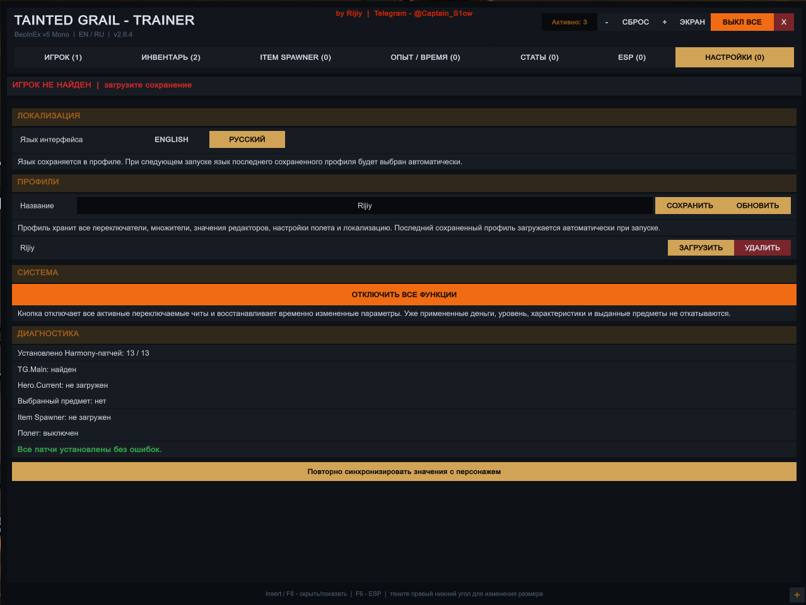
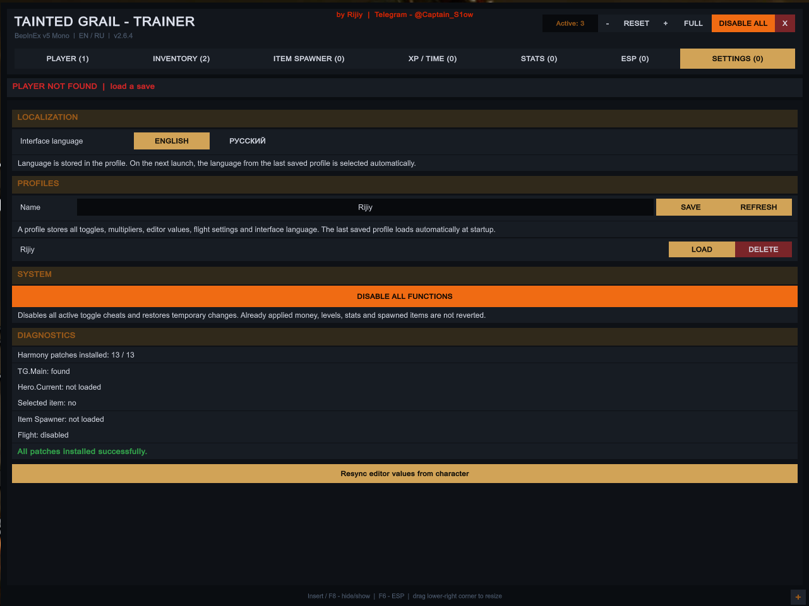

# Tainted Grail: The Fall of Avalon — трейнер

### автор — Rijiy

Telegram: [@Captain_S1ow](https://t.me/Captain_S1ow)

[English](README.md) | Русский

[](https://github.com/Fenrisu1ven/FoA_Trainer/releases/latest)

[](https://github.com/BepInEx/BepInEx/releases)


**Текущая стабильная версия: V18.4 / 2.6.4**

FoA Trainer — внутриигровой BepInEx-трейнер для **Tainted Grail: The Fall of Avalon**. Он объединяет игровые модификаторы, редактирование персонажа и инвентаря, профили, режим полёта / NoClip, расширенный Item Spawner с поиском и настраиваемый ESP в одном интерфейсе на английском и русском языках.

[Возможности](#возможности) • [Настраиваемый ESP](#настраиваемый-esp) • [Установка](#установка) • [Управление](#управление) • [Item Spawner](#item-spawner) • [Профили](#профили) • [Скриншоты](#скриншоты) • [Сборка](#сборка-из-исходников) • [Диагностика](#диагностика) • [История изменений](#история-изменений) • [Отказ от ответственности](#отказ-от-ответственности)

> [!NOTE]
> V18.4 — текущая стабильная сборка, созданная непосредственно на основе подтверждённо рабочей V18.3. В ней сохранена консервативная архитектура, необходимая для игрового Mono.CSharp. Совместимость со всеми версиями игры не гарантируется.

## Возможности

### Игрок и бой

- Режим бога / игнорирование попаданий
- Бесконечные здоровье, мана, выносливость и другие ресурсы персонажа
- Режим скрытности и упрощённый взлом замков
- Убийство с одного удара
- Множители урона, защиты, расхода маны и выносливости
- Настройка скорости движения и высоты прыжка
- Отключение урона от падения
- Режим полёта / NoClip

### Инвентарь

- Редакторы денег и Wyrd/ресурсов
- Нулевой вес предметов и экипировки
- Игнорирование требований крафта
- Редакторы количества зелий, расходников, материалов и выбранного предмета
- Редактор уровня выбранного предмета

### Персонаж и мир

- Управление опытом, опытом навыков/мастерства и множителями
- Редакторы уровня, очков характеристик и очков навыков
- Редакторы основных характеристик и значений навыков/мастерства
- Скорость игры и движения, заморозка и скорость течения времени суток

### Профили и интерфейс

- Несколько именованных профилей с сохранением, обновлением, загрузкой и удалением
- Автоматическое повторное применение последнего сохранённого профиля
- Сохранение включённых функций, множителей, редакторов, полёта, ESP и языка интерфейса
- Английская и русская локализация; английский язык выбран по умолчанию
- Изменяемое окно размером 1280×960 по умолчанию и полноэкранный режим
- Счётчики активных функций, общий счётчик и кнопка **Disable All / Отключить все**
- Страница состояния и диагностики

## Настраиваемый ESP

ESP — одна из основных функций V18.4. Оверлей продолжает работать, когда меню трейнера скрыто.

- `F6` — общий переключатель ESP
- Отдельные группы предметов, доступных для обыска контейнеров/трупов, врагов и NPC
- Независимая дальность для предметов, контейнеров, врагов и NPC
- Фильтры предметов: оружие, броня/щиты, расходники, материалы, важные/ключевые и прочие предметы
- Отдельное включение названий и расстояния
- Лёгкие буквенные/символьные значки
- Настройка размера значков и режим только значков
- Независимые переключатели текста HP и полосок HP
- Компактные полоски HP высотой 3 px с регулируемой шириной
- Настройка отображения мёртвых NPC и врагов
- Статус `ЛУТ / ПУСТО` для доступных для обыска контейнеров и трупов
- Скрытие пустых контейнеров и трупов
- Настройка размера текста, тёмного фона, интервала сканирования и максимального числа объектов на экране
- Счётчики кеша ESP, найденных объектов, видимых меток и камеры

### Производительность и стабильность

V18.4 сохраняет безопасный для производительности сканер из стабильной ветки V18.3:

- Вместо полного перебора всех `Location` используются целевые вызовы `World.All<T>()`.
- `PickItemAction` применяется для выброшенных и доступных для подбора предметов.
- `SearchAction` применяется для контейнеров и трупов, которые можно обыскать.
- `NpcElement` используется для определения состояния NPC/врага.
- Коллекции `ModelsSet<T>` при необходимости перечисляются через `GetManagedEnumerator()`.
- Доступ через reflection кешируется, поэтому одни и те же поля и свойства не ищутся повторно.
- Оверлей рисуется только во время событий Unity `Repaint`.
- Фильтр по расстоянию выполняется до более дорогого вызова `SearchAction.IsEmpty()`.
- Состояния NPC собираются до обработки трупов; мёртвые NPC/враги не рисуются через ветку живых персонажей.

## Установка

### Требования

- Windows
- Mono-версия/ветка Tainted Grail: The Fall of Avalon
- BepInEx 5

### Порядок установки

1. Установите [BepInEx 5](https://github.com/BepInEx/BepInEx/releases) для Mono-версии игры.
2. Один раз запустите игру, чтобы BepInEx создал необходимые папки.
3. Скачайте `FoATrainer_V18_4.dll` из [последнего релиза GitHub](https://github.com/Fenrisu1ven/FoA_Trainer/releases/latest).
4. Скопируйте DLL в папку:

   ```text
   <Папка игры>/BepInEx/plugins/
   ```

5. Удалите из папки plugins предыдущие версии `FoATrainer_*.dll`.
6. Запустите игру.
7. Нажмите `Insert`, чтобы открыть или скрыть трейнер.

`F8` — запасная клавиша открытия меню. `F11` переключает полноэкранный и оконный режимы трейнера.

## Управление

| Клавиша | Действие |
| --- | --- |
| `Insert` | Показать / скрыть трейнер |
| `F8` | Альтернативная клавиша открытия трейнера |
| `F6` | Включить / выключить ESP |
| `F7` | Полёт / NoClip |
| `F11` | Полноэкранный / оконный режим |
| `WASD` | Перемещение в полёте |
| `Space` | Лететь вверх |
| `Ctrl` | Лететь вниз |
| `Shift` | Ускорение в полёте |

У отдельных функций есть собственные горячие клавиши — они указаны непосредственно в интерфейсе трейнера.

## Item Spawner

Item Spawner считывает доступные шаблоны предметов и распределяет их по многоуровневым фильтрам. Например:

```text
Оружие → Луки → Короткие / Средние / Тяжёлые
Оружие → Мечи
```

Поиск выполняется внутри выбранной категории и подтипа. Карточка предмета может показывать название, категорию/тип, уровень, количество, базовую цену и цену покупки, вес, рассчитанный урон и другие характеристики, а также требования — если эти поля доступны в текущей версии игры. Требования сравниваются с параметрами персонажа и выделяются зелёным/красным цветом.

## Профили

Профили сохраняются в папке:

```text
BepInEx/config/FoATrainer_Profiles/
```

Профиль содержит переключатели, множители, значения редакторов, параметры полёта, настройки ESP и язык интерфейса. Сохранение под существующим именем обновляет профиль. При следующем запуске последний сохранённый профиль автоматически выбирается и повторно применяется после инициализации персонажа.

## Скриншоты

### Настройки и диагностика — Русский



### Настройки и диагностика — English



Оба скриншота показывают актуальный интерфейс V18.4 / 2.6.4 с доступной вкладкой ESP. Настоящий снимок внутриигрового ESP-оверлея можно будет добавить позднее.

## Сборка из исходников

```bash
git clone https://github.com/Fenrisu1ven/FoA_Trainer.git
cd FoA_Trainer
python tools/build.py
```

Результат:

```text
dist/FoATrainer_V18_4.dll
```

Проект намеренно использует архитектуру bootstrap + runtime compilation вместо обычного проекта для современного .NET SDK. Bootstrap BepInEx содержит `FoATrainerRuntime.cs` и при запуске игры компилирует его через Mono.CSharp с использованием уже загруженных игровых и системных сборок.

`tools/build.py` создаёт новый GUID модуля при каждой сборке, поэтому функционально одинаковые DLL могут иметь разные SHA-256. Готовая DLL в `dist/` — подтверждённый в игре бинарник V18.4 из исходного пакета.

### Структура исходников

- `src/FoATrainerRuntime.cs` — полная логика runtime, интерфейса, ESP и игровых функций
- `src/Bootstrap.reference.cs` — читаемый C#-эквивалент создаваемого bootstrap
- `tools/build.py` — автономный генератор bootstrap/DLL для V18.4
- `dist/FoATrainer_V18_4.dll` — подтверждённый в игре бинарник V18.4
- `screenshots/settings-en.png` и `screenshots/settings-ru.png` — актуальные скриншоты интерфейса V18.4

В репозитории отсутствуют игровые сборки, DLL BepInEx/Harmony и другие защищённые файлы игры.

## Диагностика

Журналы запуска и компиляции:

- `BepInEx/FoATrainer_boot.log`
- `BepInEx/FoATrainer_compile.log`
- `BepInEx/LogOutput.log`

Предоставленная проверка V18.4 в игре показывает строку `Runtime started. Patches: 13, missing: 0`, успешное применение стартового профиля и отсутствие ошибок компиляции. Известный вывод ограничен предупреждениями о дублирующихся предопределённых типах и неиспользуемом `_texEspBg`.

## История изменений

История версий находится в [CHANGELOG.md](CHANGELOG.md), готовые сборки — в разделе [GitHub Releases](https://github.com/Fenrisu1ven/FoA_Trainer/releases).

## Автор

**Rijiy**

Telegram: [@Captain_S1ow](https://t.me/Captain_S1ow)

## Отказ от ответственности

Проект является неофициальной любительской модификацией и не связан с Awaken Realms или разработчиками/издателями Tainted Grail: The Fall of Avalon, не одобрен ими и не поддерживается ими.

Используйте модификацию на свой риск. Перед применением игровых модификаций создайте резервные копии важных сохранений.

Это трейнер/мод для одиночной игры, не предназначенный для соревновательных или многопользовательских режимов.
